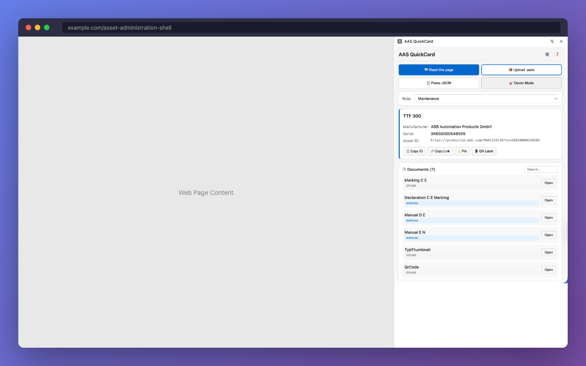

# AAS QuickCard

**Turn complex Asset Administration Shell data into actionable equipment cards.**

[](https://chrome.google.com/webstore)
[](LICENSE)
[](https://developer.chrome.com/docs/extensions/mv3/)

AAS QuickCard is a Chrome extension that extracts and displays Asset Administration Shell (AAS) data in a human-readable side panel. Built for plant operators, maintenance engineers, quality teams, and procurement specialists who need quick access to equipment information.

<p align="center">
  
</p>

---

## Features

### Data Input
| Method | Description |
|--------|-------------|
| **Read from Page** | Extract AAS JSON directly from any web page |
| **Upload AASX** | Load AASX packages (ZIP with JSON or XML) |
| **Paste JSON** | Paste AAS JSON from clipboard |
| **Demo Mode** | Try instantly with sample industrial data |

### Role-Based Views

See only what matters for your job:

| Role | Focus Areas |
|------|-------------|
| **Operator** | Safety documents, operating manuals, carbon footprint |
| **Maintenance** | Service contacts, spare parts, technical specs |
| **Quality** | Certificates, compliance checklists, test reports |
| **Procurement** | Ordering info, spare parts catalog, supplier contacts |

### Compliance Checking

Run compliance audits against major regulatory frameworks:

- **CE Marking** - EU product safety requirements
- **REACH** - Chemical safety (SVHC substances)
- **RoHS** - Hazardous substance restrictions
- **DPP** - Digital Product Passport readiness

### IDTA Submodel Recognition

Automatically detects and extracts data from standard IDTA templates:

- Digital Nameplate (IDTA-02006)
- Handover Documentation (IDTA-02004)
- Carbon Footprint / PCF (IDTA-02023)
- Technical Data (IDTA-02002)
- Contact Information (IDTA-02002)

### Additional Capabilities

- **Favorites** - Pin assets with tags, categories, and notes
- **Search & Filter** - Find pinned assets quickly
- **Asset Comparison** - Compare 2-3 assets side by side
- **QR Labels** - Generate QR codes for asset identification
- **Support Tickets** - Copy pre-formatted ticket text
- **Lifecycle Phase** - Track asset lifecycle status
- **Spare Parts** - View and export spare parts lists
- **Carbon Footprint** - Display PCF data when available

---

## Installation

### Chrome Web Store

Coming soon.

### From Source

```bash
# Clone and install
git clone https://github.com/hadijannat/aas-quickcard.git
cd aas-quickcard
npm install

# Build
npm run build

# Load in Chrome
# 1. Go to chrome://extensions
# 2. Enable "Developer mode"
# 3. Click "Load unpacked"
# 4. Select the dist/ folder
```

---

## Development

```bash
npm run dev              # Watch mode
npm run build            # Production build
npm run lint             # Type check
npm run check-rhc        # CWS compliance scan
npm run validate-manifest
npm run pack             # Create submission ZIP
```

### Project Structure

```
src/
├── parser/          # AASX, JSON, XML parsing
├── compliance/      # Regulatory compliance checks
├── shared/          # Types, storage, utilities
├── sidepanel/       # Main UI
├── options/         # Settings page
└── background/      # Service worker
```

See [CLAUDE.md](CLAUDE.md) for detailed architecture documentation.

---

## Supported Formats

| Format | Support |
|--------|---------|
| AASX (JSON payload) | Full |
| AASX (XML payload) | Full |
| AAS JSON (admin-shell.io) | Full |
| AAS XML | Full |

---

## Privacy & Security

- **100% local processing** - No data leaves your browser
- **No external requests** - All code bundled locally
- **Minimal permissions** - Only what's needed
- **No tracking** - Zero analytics or telemetry

See [Privacy Policy](docs/PRIVACY.md) and [Permission Justification](docs/PERMISSIONS.md).

---

## Contributing

1. Fork the repository
2. Create a feature branch
3. Run `npm run build && npm run check-rhc` before committing
4. Submit a pull request

---

## License

MIT
